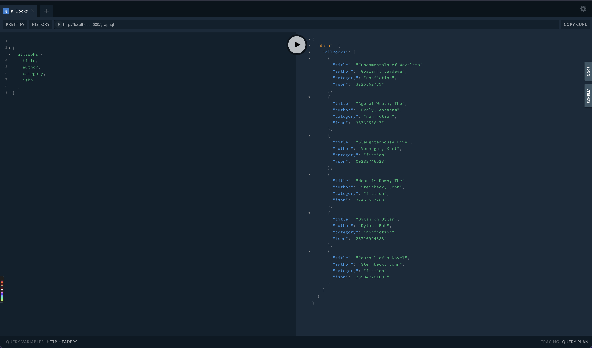

# Booksrus 📖

Booksrus is a comprehensive and modern BFF Graphql-based API to interact with inventory, reserve and purchase books at Books-R-Us!

## Installation 🚀

Use the package manager [yarn](https://yarnpkg.com/) to install dependencies.

```bash
yarn install
```

## Usage 🎡

```bash
yarn start
```

- Open browser and navigate to [http://localhost:4000/graphql ](http://localhost:4000/graphql)
- Review `mutations.gql` and `queries.gql` in `~/tests` directory to find example queries to interact with API
- Copy/paste query or mutation from example files into graphql playground and execute
- _(Optional)_ Use `DOCS` or `SCHEMA` tabs in playground to explore other endpoints and the data schema available from the API

## Contributing ✏️
Pull requests are welcome. For major changes, please open an issue first to discuss what you would like to change.

## License 🔍
[MIT](https://choosealicense.com/licenses/mit/)